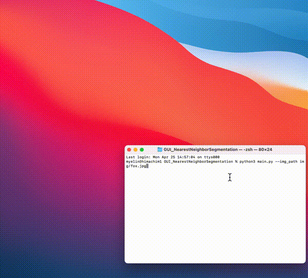

# GUI_NearestNeighborSegmentation
最近傍識別による領域分割のGUIアプリケーションです。  
TkinterとNumpyとPillowで動きます。

## 実行環境
```
Python  3.9.12
numpy   1.22.3
Pillow  8.4.0
```

## 利用方法
```
git clone https://github.com/shinome551/GUI_NearestNeighborSegmentation.git
cd GUI_NearestNeighborSegmentation
```
```
# main.pyの引数として画像のパスを与える
# python3 main.py --img_path [img_path]
# サンプル画像での例
python3 main.py --img_path img/fox.jpg
```

## 使用例
<div align="center">
    
</div>

## ボタンの説明
画面上をドラッグすると矩形が描画され、矩形内部の画素を指定されたラベル（前景/背景）の事例として記録します。  
「Segmentation ON」ボタンを押すことで、記録された事例を元に画像上の画素を分類し、領域分割を実行します。  

- Segmentation ON/OFFボタン（トグルボタン）  
「Segmentation ON」を押すと領域分割が行われ、画像上に領域マスクが描画されます。  
「Segmentation OFF」を押すと領域マスクが除去されます（事例は記録されたままです）。

- Resetボタン  
記録された事例が初期化され、領域マスクが描画されていれば除去されます。また、指定するラベルの状態が前景に初期化されます。

- Background/Foregroundボタン（ラジオボタン）  
各ボタンをクリックすることで、事例を記録する際に指定するラベルを切り替えられます。初期状態は「Foreground」です。

## 注意
- 領域分割は前景事例と背景事例の両方を記録してから行ってください。  
- 領域分割後に事例を追加して再度領域分割を行う場合は、「Segmentation OFF」ボタンを押して一度領域マスクを除去する必要があります（「Reset」ボタンを押さない限り、記録された事例は消去されません）。
